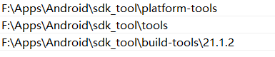

# 由于在安装配置Android Studio以及SDK manager的时候碰到很多问题。主要是由于一些下载问题。由此记录一下

## 先来明确一些概念
+ Android Studio
  一个开发安卓应用的IDE（Integral Development Editor）。其本身并不带有安卓系统的接口包和代码包
+ SDK
  Software Development Kit 包含了开发安卓应用需要的API。其实这里SDK应该是一个统称，谷歌开发了SDK manager来管理一些sdk的东西。sdk_platform 也简称sdk
+ SDK
  这其实应该算是一个统称。包含了各种tools和platforms
  在系统环境变量里面新建一个环境变量如下。或者在AS里面的【file-setting-Appearance&Behavior-System Settings-Android SDK】里面的Android SDK location的路径里面设置。则在AS里面下载的各个Platforms和各种tool都会放置在下面的目录。同理，如果你离线下载解压到里面，AS也会自动读取当成是已安装的。（在AS里面各种tools应该只能下载最新版，离线下载可以安装旧版本）
  ```
  变量名：ANDROID_HOME
  VALUE: /PATH/TO/SDK_HOME
  ```
+ 设置完ANDROID_HOME环境变量之后，可以选择在AS里面直接下载各种platforms和tools
  默认从：dl.google.com 和 dl-ssl.google.com两个地址下载资源。这两个地址现在目前没有被墙，但是不同服务点速度不一样。
  从 http://ping.chinaz.com/ 里面`ping dl.google.com`。然后选择一个最快的国内ip。用管理员权限打开powershell，进入
  `C:\WINDOWS\system32\drivers\etc> `    
  `notepad hosts`
  添加这两项：
  `fastest_ip dl.google.com`
  `fastest_ip dl-ssl.google.com`
  最好再清理一下dns缓存
  ```
  win+R: cmd
  ipconfig/flushdns
  ```
  然后就应该可以在AS里面直接快速下载了。
  PS：不要看网上那种镜像代理，没有一个是可以用的。
+ SDK manager&AVD manager
  一个用来下载（管理）各版本sdk以及build tool以及其他与安卓开发有关的资源包。下载地址：[https://www.androiddevtools.cn/]<br>
  从这里面的【SDK tools】下载windows安装包安装后则会有这两个工具。安装的目录当成是ANDROID_HOME。但是新的版本好像已经不用这两个manager了，直接集成在AS里面。所以不需要下载。并且，即使按照上面绑定了ip，在里面还是无法更新列表
+ build tools & tools & platform tools & system images
  如果在AS里面无法自动下载的话，那就全部只能离线下载。
  https://androidsdkmanager.azurewebsites.net/tools.html
  这是经过测试下载最快速的连接。
  
  1. 创建ANDROID_HOME目录，添加环境变量
  2. 从上面网站下载SDK Tools并解压出来，里面有一个tools目录，复制到ANDROID_HOME里面
  3. 下载build-tools，解压复制到ANDROID_HOME
  4. 下载platform-tools，解压复制到ANDROID_HOME
  5. 把tools，build tools，platform tools目录添加到系统`PATH`变量。最终如图
  6. <br>
+ gradle
  当第一次创建AS项目并且初始化build的时候，AS需要下载gradle以及gradle插件（gradle和gradle插件时两个不同的东西）。如果下载十分慢的话，需要手动下载gradle。
  具体操作可以见这里 https://blog.csdn.net/fuchaosz/article/details/51567808
  gradle和gradle插件是有一定的版本匹配的： https://developer.android.com/studio/releases/gradle-plugin?hl=zh-cn
  gradle可以离线安装，但是gradle插件没有找到离线安装方式。但是安装完gradle之后在build.gradle里面指定dependencies（gradle插件）版本后应该下载是可以完成的，可能需要一点时间。

+ 如果是gradle插件下载特别慢的话，可以尝试用这里的方法（没有尝试过）
  https://subaochen.github.io/android/2019/08/08/android-dl-google-com-aliyun/

## 总结
这次之所以搞了这么久，很大一个程度是被SDK manager坑了。绑定了dl-google.com绑定host之后在这里面还是无法更新列表。只能使用本地的翻墙代理，但是不知道为什么，设置代理之后也十分缓慢。殊不知，在AS里面也有集成一个SDKmanager。在里面可以很快速地下载。
然后第一次build项目的时候，gradle的下载也搞了很久很久。