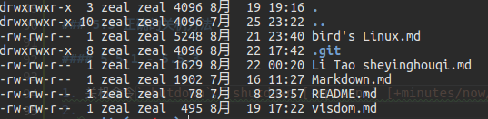
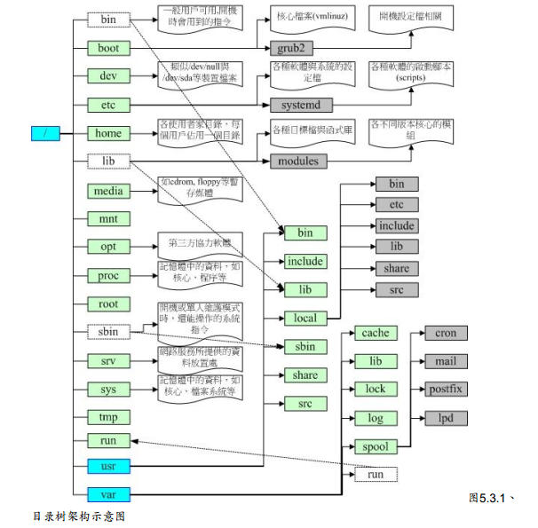

# 鸟哥的Linux私房菜（第三版）笔记

## 第三章 主机规划与磁盘分区

### 3.1 Linux与硬件的搭配

### 3.1.3 各硬件设备在linux中的文件名 P67

1. 1、IDE硬盘：/dev/hd[a-d]<br>2、SCSI/SATA/USB硬盘：/dev/sd[a-p]<br>3、U盘：与SATA相同<br>4、打印机：/dev/lp

### 3.2 磁盘分区

#### 3.2.1-3.2.3

1. IDE接口可以连接两个IDE设备，通常主机会有两个IDE接口（IDE1 primary；IDE2 secondary），所以最多可以有4个IDE设备（一种硬盘连接方式）。每条电缆的IDE设备被区分为Master（主设备）与Slave（从设备）。所以4个IDE设备的文件名为：/dev/hda, /dev/hdb, /dev/hdc, /dev/hdd
2. 现在大部分磁盘接口为SATA，包括USB也是使用同样的模块，于是文件名为： /dev/sd[a-p]
3. 磁盘每个盘片可以分出扇区（Sector）、柱面（Cylinder）。主引导分区（Master Boot Record， MBR）：可以安装引导、分区表（partition table）：记录整块硬盘的分区状态，这两个位于第一个扇区，所以硬盘的第一个扇区很重要，如果损坏，可能整块硬盘就坏了
4. 硬盘默认的分区表最多能写入4组分区信息（主Primary或扩展Extended分区，最多只能有一个扩展分区），扩展分区实际上分成多个逻辑logical分区，所以逻辑分区的设备名称号码从5开始（/dev/sda5)。如果扩展分区被破坏，那么所有逻辑分区将会被删除。
5. IDE硬盘最多可以有59个逻辑分区（5-63），SATA硬盘可以有11个逻辑分区（5-15）

#### 3.2.4 开机流程与主引导分区（MBR）

1. 1、CMOS：是记录各项硬件参数且嵌入到主板上面的存储器 <br> 2、BIOS:是一个写入到主板上的韧体（写入到硬件上的一个软件程序）
2. BIOS是开机的时候系统主动执行的第一个程序，到能够开机的硬盘里面去读取第一个扇区的MBR。然后MBR引导进入boot loader（引导加载程序），然后boot loader 读取内核文件
3. 每个分区拥有自己的启动扇区，boot loader可以安装在MBR（仅446B）或者启动扇区里。
4. boot loader有如下功能：1）、提供菜单 2）、载入内核文件 3）、转交给其他loader（比如多系统在MBR中的boot loader引导进入安装有Linux分区的启动扇区中boot loader）
5. 实际可开机的内核文件是放置到各分区内的
6. 挂载：为了结合目录树的架构与硬盘存储文件，所谓“挂载”就是利用一个目录当成进入点，将`磁盘分区`的数据放置在该目录下，及进入了该`目录`就是进入该`硬盘分区`
7. 为了保证开机时能够正确载入系统启动文件，安装系统的时候最好将`/boot`目录放在磁盘最前面的分区（将启动扇区所在的分区规范在小于1024个柱面以内）。也就是在安装的时候按顺序规划出分区（`/boot`、`/`、`/swap`\……）

-----

## 第四章 安装centos 5.x 与多重引导小技巧

### 4.2 开始安装centos 5

#### 4.2.3 磁盘分区

1. 在创建boot分区时可以选择强制为主分区，这样安装程序会把`boot`分区放到磁盘最前面
2. swap内存交换空间的功能是：当数据被放在物理内存但是又不常被CPU使用，系统就可以将其丢在swap交换空间中，而将速度较快的物理内存空间释放出来给真正需要的程序使用。（`所以，当系统内存较大4GB以上，可以不设置swap目录）

-----

## 第五章 首次登录与在线求助man page

### 5.1 首次登录系统

#### 5.1.1-5.1.5

1. 在安装系统时设置的用户为`管理员（root）`用户，最好命名为`root`；然后在安装完系统后再新建一个`个人账户`
2. 在开机后的登录界面，按`Ctrl+Alt+[F1-F6]`可以以`文字界面（命令行模式）`登录。`Ctrl+Alt+F7`则是图形界面（默认）。在文字界面要转到图形界面的命令是：

```python
shartx
# 但是要保证相关服务开启转到图形界面才不会错误
```

3. 在命令行注销系统的命令是`exit`

### 5.2 在命令行模式下执行命令

#### 5.2.1

1. 命令行模式登录后所取得的程序被称为`shell`，因为这个程序负责最外层的跟用户的通信工作
2. command [-option] parameter1 parameter2
3. 命令， -option， 参数等几个命令中间以空格区分，不论空几格`shell`都视为一格
4. 命令太长时，可以使用`反斜杠(\)`来转义[Enter]，使命令连续到下一行
5. 区分大小写

#### 5.2.2 基础命令操作

1. `date` 显示系统当前日期和时间
2. `cal` 显示日历， `cal [[month] year] (cal 10 2009)` 显示指定（月）年的日历
3. `bc` 简单计算器，`scale=number` 指定小数点后的位数为`number`

### 5.3 Linux 系统的在线求助 man page 和 info page

#### 5.3.1 man page

1. `man command` 显示命令`command`的说明，如`man date`
2. 按空格键下一页，按`q`退出说明书；按`/`然后输入字符可以查找指定字符
3. 在 man page 的首行显示的是`DATE（1）`（以 man date 命令为例），括号中的数字有不同含义：1 表示用户在shell环境中可以操作的命令或文件， 5 表示配置文件或格式， 8 表示系统管理员可用的命令。详见P124

#### 5.3.2 info page

1. `info command` 显示命令`command`的说明（info格式，需要有info格式的说明文档存在/use/share/info目录下），格式会比`man page`更清晰
2. N,P,U 按键作用分别是`下一个、上一个、上一层`结点
3. Tab在结点间切换以供[Enter]选择
4. `/use/share/doc`目录下存放这各个软件包的说明文档
5. Linux 下有一个超简单的文本编辑器`nano`

### 5.5 正确的关机方法

#### 5.5.1 - 5.5.3

1. 关机命令`shutdown`，`shutdown [-options] [+minutes/now/+0/hh:mm] ['warning message']`,这个命令也可以重启系统，详见man page

-----

## 第六章 Linux的文件权限与目录配置

### 6.1 用户与用户组

1. 在Linux下有`用户、用户组、其他（others）`的管理概念

### 6.2 Linux文件权限概念

#### 6.2.1 Linux文件属性

1. 命令`ls -al`可以显示出当前文件夹下所有（包括隐藏文件）的文件的详细属性
2. <br><br>
其意义分别是【权限】【连接】【所有者】【用户组】【文件容量】【修改日期】【文件名】
3. 【权限】共有10个字符，第一个字符有不同含义，后面9个每3个为一组（`rwx`格式），分别为【文件所有者的权限】【同用户组的权限】【其他非本用户组的权限】；其中，`r`、`w`表示可读可写，`x`表示可执行。（详见P142）

#### 6.2.2 如何改变文件属性和权限

1. + chgrp:改变文件所属用户组
   + chown:改变文件所有者
   + chmod：改变文件的权限
2. `chgrp [-R] groupname filename`
    + `-R`表示递归（recursive）的持续更改，也即连同子目录下的所有文件、目录都更新为这个用户组<br>
    + groupname 必须存在于`/etc/group`这个文件里
    + 复制行为会同时复制文件的各个权限
3. `chown [-R] 账号名称[:用户组] 文件或目录`
    + 如果只指定用户组，即 `:用户组`，则可以改变文件的用户组
4.  `chmod [-R] 770/ugoa=rwx 文件或目录`
+ 用数字类型改变文件权限`chomd [-R] 770 文件或目录`
    1. 我们使用数字来代表各个权限`r:4, w:2, x:1`，每种身份`owner、group、others`对应的位置的权限加起来就是对应位置的数字<br>
    2. 比如当用vim编辑了一个文件后，其权限通常是`-rw-rw-r--`，也就是`664`；如果要将文件变成可执行文件，并且不要让其他人修改此文件的话，就需要`-rwxr-xr-x`这样的权限，也就是`chmod 775 xxx.sh`
+ 用符号类型改变文件权限
    1. 我们用`u, g, o`表示`user, group, others`, `a`表示`所有身份`
    2. `+、-、=`表示`加入、出去、设置`权限
    3. 比如设置一个文件的权限为`-rwxr-xr-x`为`chomd u=rwx,go=rx filename`
    4. 每个身份加入可写入权限:`chomd a+w filename`
    5. 去除所有人的可执行权限:`chomd a-x filename`

#### 6.2.3 目录与文件的权限意义

1. 各权限对目录的意义
    + `r`表示具有读取目录结构列表的权限，也就是查询该目录下的文件名
    + `w`对目录来说有很强大的作用，可以：1）、新建文件与目录。2）、删除已经存在的文件与目录（不论该文件的权限为何）。3）、重命名、转移位置
    + `x`表示用户能进入该目录成为工作目录

#### 6.2.4 Linux文件种类与扩展名

1. 任何设备在Linux下都是文件，Linux文件是没有所谓的‘扩展名’的，只不过我们用扩展名来了解该文件是什么东西

### 6.3 Linux 目录配置

#### 6.3.1 Linux 目录配置标准

1. 各个distribution的Linux应该遵循 `Filesystem Hierarchy Standard （FHS）`标准
2.  + /(root,根目录)：与开机系统有关
    + /usr（`UNIX software resource`)：与软件安装、执行有关
    + /var (`variable`)：与系统运作过程有关
3. 根目录（/）的意义与内容
    + 根目录十分重要（与开机、还原、系统修复有关），所以FHS希望根目录`不要放在非常大的分区内`，因为越大的分区会放入越多的数据，如此一来根目录所在的分区就可能会发生较多的错误
    + 保持根目录所在的分区`越小越好`，且`应用程序`安装的软件最好不要与根目录放在同一个分区
4. 根目录下各个目录应该放置的文件内容
    + `/bin` : 放置在`单用户模式`下还能被操作的命令，主要有cat、chmod、chown、date、mv、mkdir、cp、bash等
    + `/boot` : 主要放置开机需要文件，比如内核，/boot/grub等
    + `/dev` : 所有设备
    + `/etc` : 系统主要的配置文件几乎都放在这，例如`账号密码文件`、各个服务的起始文件等，建议不要在此目录放置`可执行文件`。其中有`/etc/init.d/`,放置开机默认启动脚本
    + `/media` : 放置可删除的设备，包括软盘、光盘、DVD
    + `/mnt` : 暂时挂载额外设备
    + `/opt` : 第三方软件放置的目录
    + `/root` : 系统管理员的主文件夹
    + `/srv` : service，一些网络服务（如www、ftp等）启动之后，这些服务所需要取用的数据目录
    + `/tmp` : 让一般用户或者是正在执行的程序暂时放置文件的地方
5. 非FHS标准规定的其他根目录下的目录
    + `/lost+found` : ext2/ext3 文件系统格式产生的一个目录，目的在于当文件系统发生错误时，将一些丢失的片段放置到这个目录下
    + `/proc` 和 `/sys` : 都是虚拟文件系统(virtual filesystem), 放置的数据都是在内存当中，所以不占用硬盘容量。存储有关系统内核，进程等信息。
6. /usr  的意义与内容
    + `usr`是`UNIX software resource`的缩写，也就是“UNIX操作系统软件资源”
    + 所有系统默认的软件（distribution发布者提供的软件）都会放置在这个目录下面。系统刚安装完毕，这个目录会占用最多的硬盘容量
    + `/usr`的子目录建议有以下这些：
        + `/usr/bin/` : 绝大部分的用户可使用的命令
        + `/usr/include/` : C、C++等程序语言的头文件
        + `/usr/lib/` : 包含个应用软件的函数库，目标文件。一些脚本
        + `/usr/local` : 系统管理员在本机安装自己下载的软件（非distribution默认提供者），建议安装到此目录，便于管理。
        + `/usr/share/` : 放置共享文件的地方。包括`/usr/share/man, /usr/share/doc`
        + `/usr/src/` : 源码放置的地方，src有source的意思。内核源码则建议放在`/usr/src/linux/`的目录下
7. /var 的意义及内容
    + /usr 是安装时会占用较大硬盘容量的目录， `/var`是系统运行后会见见占用硬盘容量的目录。/var目录主要针对`常态性变动`的文件，包括缓存（cache）、登录文件（log）等
    + 根据FHS的定义，最好将`/var`独立出来，这样对于系统的数据还有一些安全性保护
    + `/var` 下的建议子目录
        + `/var/cache/` : 应用程序运行过程中的缓存文件
        + `/var/lib` : 程序本身执行的过程中，需要使用到的数据文件放置的目录
        + `/var/lock/` : 某些设备或文件资源不能同时被多人使用，被使用时需要锁定
        + `/var/log` : 登录文件放置的目录。/var/log/messages:,/var/log/wtmp(记录登陆者的信息)
8. Linux目录树结构



-----

## 第七章 Linux文件与目录管理

### 7.1 目录与路径

#### 7.1.2 目录的相关操作

1. `-` : 代表前一个工作目录
2. `～` : 代表‘目前用户’所在的主文件夹
3. `～account` :  代表account用户的主文件夹
4. `pwd` ：print work directory，显示当前路径
5. `mkdir [-p] directory` : 加上`p`参数可以创建多层目录，如：mkdir -p test1/test2/test3/test4
6. `rmdir` : 删除`空目录`

#### 7.1.3 执行文件路径变量：$PATH

1. 当在命令行执行命令时，系统会依照PATH的设置到各个目录下查询该命令的可执行文件，先查询到者先被执行
2. `echo` 可以`显示、打印出内容`，`echo $PATH`可以打印出PATH目录，`$`表示后面接的是变量
3. 打印出的路径之间用`：`分开
4. 添加路径到`PATH`变量下用这个命令：`PATH="$PATH":/路径`

### 7.2 文件与目录管理

#### 7.2.1 查看文件与目录ls

1. `-h`：（human-like）将文件容量大小以人类较易读的方式（GB，KB）显示出来。注意，用ls只能列出“文件夹快捷方式”大小而无法打印出整个目录的总大小，要使用`du`目录
2. `-r`：反向排序打印

#### 7.2.2 复制、删除、移动：cp，rm，mv

1. cp（copy）可以复制、创建连接文件（快捷方式）、复制整个目录
2. mv（move）可以移动文件目录、重命名
3. cp命令参数：
    1. -i：若目标文件存在，则询问是否继续
    2. -r：递归持续复制，用于目录复制
    3. -s：复制成为符号链接文件（symbolic link），即快捷方式
4. `basename path` 取得路径下最后的文件名：<br> basename /etc/sysconfig/network <br>打印：network
5. `dirname`取得目录名。<br>
/etc/sysconfig/network<br>
打印：/etc/sysconfig

### 7.3 文件内容查询

#### 7.3.2 可翻页查看

1. `less`命令非常有用，记得用它代替`cat`，可以翻页并且退出后不会占用屏幕空间

#### 7.3.3 数据选取

1. `head [-n]`：显示文件前几行,如果-n后面接负数，则表示除了后面几行外全部显示
2. `tail [-n] [-f]`:显示文件后几行，如果-n后面接`+n`，则表示列出除了前面几行外的其他内容。`-f`参数可以实时检测文件的变动

### 7.5命令与文件的查询

#### 7.5.1 脚本文件名的查询

1. `which [-a] command` : 查询命令的执行文件
2. `locate [-ir] keyword` : 查找文件，这个命令是在系统数据库内直接查询，并不是查询硬盘，所以速度会很快。但是数据库可能每天才更新一次，所以有时候无法实时反应硬盘内容。
3. `updatedb` ： 更新系统数据库，由于这个命令需要查找硬盘，所以可能会需要几分钟
4. 